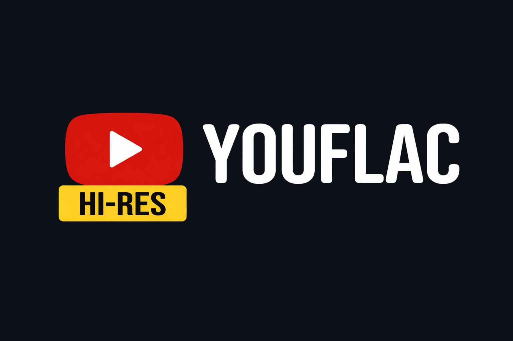
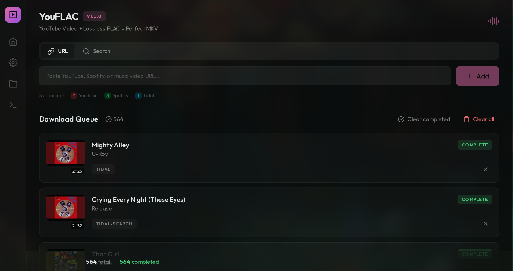

<div align="center">



### YouTube Video + Lossless FLAC Audio = Perfect MKV

[](https://github.com/kushiemoon-dev/YouFLAC/releases/latest)
[](https://ghcr.io/kushiemoon-dev/youflac)
[](LICENSE)
[](https://go.dev)


</div>

---

## Overview

**YouFLAC** combines the best of both worlds: it downloads a YouTube video and replaces the audio track with a lossless FLAC sourced from Tidal, Qobuz, or Amazon Music — producing a perfect `.mkv` file with Hi-Res audio and full 4K video.

<div align="center">

</div>

---

## Features

- **4K Video** — Best quality video from YouTube (AV1/VP9, up to 4K)
- **Lossless Audio** — FLAC sourced from Tidal, Qobuz, or Amazon Music
- **Smart Matching** — Auto-matches YouTube video to the correct audio track via song.link and ISRC
- **Quality Fallback** — Automatically falls back to next available source if preferred is unavailable
- **MKV Output** — Muxes video + FLAC into a single MKV container with proper metadata
- **Queue System** — Concurrent downloads with pause, resume, and retry support
- **Playlist Support** — Auto-generates `.m3u8` playlist after batch downloads
- **Lyrics** — Fetches synced lyrics from LRCLIB (embed in MKV or `.lrc` file)
- **NFO Files** — Generates metadata files for Jellyfin, Plex, and Kodi
- **Structured Logging** — Configurable log level and format via environment variables
- **Proxy Support** — Route all requests through a custom HTTP proxy
- **Docker + Native** — Run as a web app in Docker or as a native desktop app

---

## Install

### Docker

```bash
docker run -d \
  --name youflac \
  -p 8080:8080 \
  -v ./config:/config \
  -v ./downloads:/downloads \
  ghcr.io/kushiemoon-dev/youflac:latest
```

Or with `docker-compose`:

```bash
git clone https://github.com/kushiemoon-dev/YouFLAC.git
cd YouFLAC
docker compose up -d
```

Access the web UI at **http://localhost:8080**

### Native Binaries

**[⬇ Download Latest Release](https://github.com/kushiemoon-dev/YouFLAC/releases/latest)**

| Platform | File |
|----------|------|
| Linux x86_64 | `youflac-server-linux-amd64.tar.gz` |
| Linux ARM64 | `youflac-server-linux-arm64.tar.gz` |
| macOS Apple Silicon | `youflac-server-darwin-arm64.tar.gz` |
| Windows x86_64 | `youflac-server-windows-amd64.zip` |

```bash
# Linux / macOS
tar -xzf youflac-server-linux-amd64.tar.gz
cd youflac-server-linux-amd64
./youflac-server
```

```powershell
# Windows — extract the zip, then:
.\youflac-server.exe
```

> **Note:** Native binaries require **FFmpeg** and **yt-dlp** in PATH. The Docker image bundles both.

---

## Requirements (Native only)

| Tool | Install |
|------|---------|
| **FFmpeg** | `sudo pacman -S ffmpeg` / `brew install ffmpeg` / `choco install ffmpeg` |
| **yt-dlp** | `sudo pacman -S yt-dlp` / `brew install yt-dlp` / `pip install yt-dlp` |

---

## Configuration

All settings can be configured via environment variables or through the web UI.

| Variable | Default | Description |
|----------|---------|-------------|
| `PORT` | `8080` | HTTP server port |
| `OUTPUT_DIR` | `/downloads` | Download output directory |
| `CONFIG_DIR` | `/config` | Config file directory |
| `VIDEO_QUALITY` | `best` | `best`, `1080p`, `720p`, `480p` |
| `CONCURRENT_DOWNLOADS` | `2` | Parallel downloads (1–5) |
| `NAMING_TEMPLATE` | `jellyfin` | `jellyfin`, `plex`, `flat`, `album`, `year` |
| `GENERATE_NFO` | `true` | Generate NFO metadata files |
| `EMBED_COVER_ART` | `true` | Embed cover art in MKV |
| `LYRICS_ENABLED` | `false` | Fetch lyrics automatically |
| `LYRICS_EMBED_MODE` | `lrc` | `lrc`, `embed`, `both` |
| `LOG_LEVEL` | `info` | `debug`, `info`, `warn`, `error` |
| `LOG_FORMAT` | `text` | `text`, `json` |
| `PROXY_URL` | _(none)_ | HTTP proxy for all outbound requests |
| `DOWNLOAD_TIMEOUT_MINUTES` | `10` | Per-download timeout |

Config file location:
- **Docker**: `/config/config.json`
- **Linux**: `~/.config/youflac/config.json`
- **macOS**: `~/Library/Application Support/youflac/config.json`
- **Windows**: `%APPDATA%\youflac\config.json`

---

## How It Works

```
YouTube URL
     │
     ├──────────────────────┐
     ▼                      ▼
 yt-dlp                song.link API
 4K Video DL           Cross-platform resolve
                            │
                     ┌──────┴───────┐
                     ▼              ▼
                   Tidal          Qobuz
                   FLAC           FLAC
                     └──────┬───────┘
                            ▼
                     Amazon Music
                       FLAC fallback
                            │
     ┌──────────────────────┘
     ▼
 FFmpeg Mux
 Video + FLAC → MKV
     │
     ▼
 NFO + Cover Art + Lyrics
```

---

## API Endpoints

| Method | Endpoint | Description |
|--------|----------|-------------|
| `GET` | `/api/health` | Health check |
| `GET` | `/api/queue` | List queue items |
| `POST` | `/api/queue` | Add item to queue |
| `POST` | `/api/queue/:id/pause` | Pause an item |
| `POST` | `/api/queue/:id/resume` | Resume an item |
| `POST` | `/api/queue/retry-failed` | Retry all failed items |
| `GET` | `/api/queue/failed/export` | Export failed items as `.txt` |
| `GET` | `/api/services/status` | Audio service health check |
| `GET` | `/api/version` | Current version |

---

## Build from Source

```bash
git clone https://github.com/kushiemoon-dev/YouFLAC.git
cd YouFLAC

# Build frontend
cd frontend && npm ci && npm run build && cd ..

# Build server binary
go build -o youflac-server ./cmd/server

# Run
./youflac-server
```

---

## Credits

- [yt-dlp](https://github.com/yt-dlp/yt-dlp) — Video downloading
- [FFmpeg](https://ffmpeg.org) — Media muxing
- [Fiber](https://gofiber.io) — HTTP framework
- [song.link](https://song.link) — Cross-platform music linking
- [LRCLIB](https://lrclib.net) — Synced lyrics database
- Inspired by [SpotiFLAC](https://github.com/afkarxyz/SpotiFLAC)

---

## Disclaimer

YouFLAC is intended for **educational and private use only**. It is not affiliated with, endorsed by, or connected to YouTube, Tidal, Qobuz, Amazon Music, or any other streaming service. By using this tool, you agree to comply with all applicable laws and the Terms of Service of the platforms involved. The developers assume no liability for any misuse.

---

<div align="center">

**MIT License** · [Releases](https://github.com/kushiemoon-dev/YouFLAC/releases) · [Issues](https://github.com/kushiemoon-dev/YouFLAC/issues)

</div>
