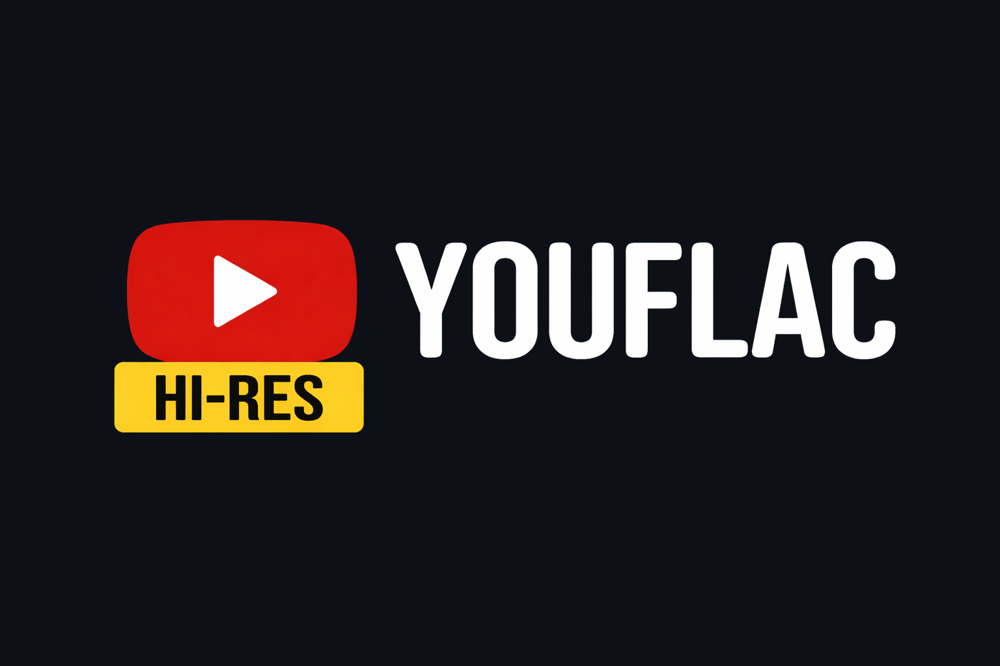
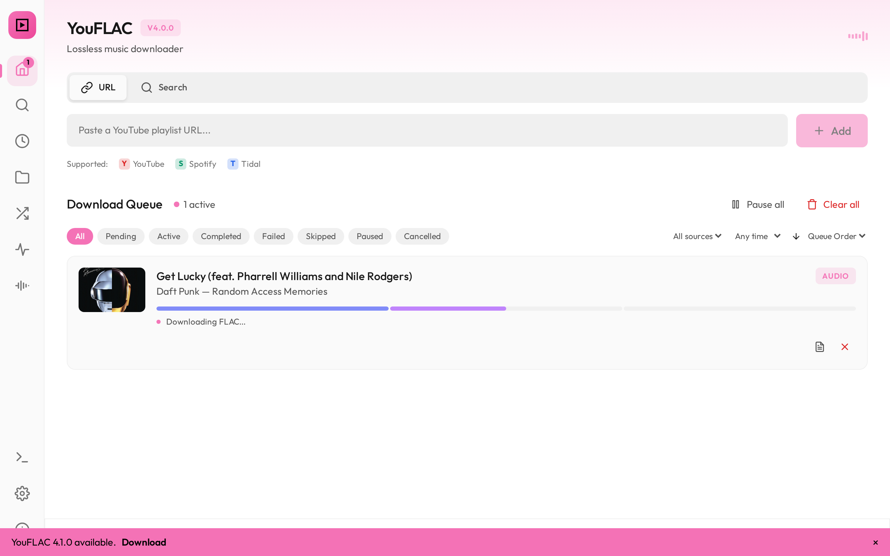
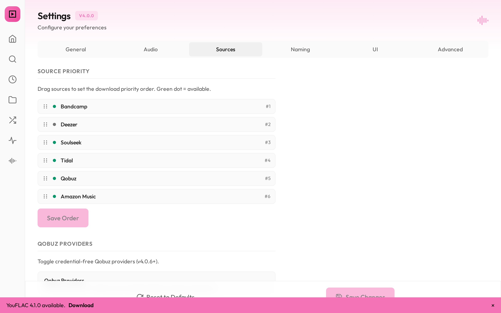
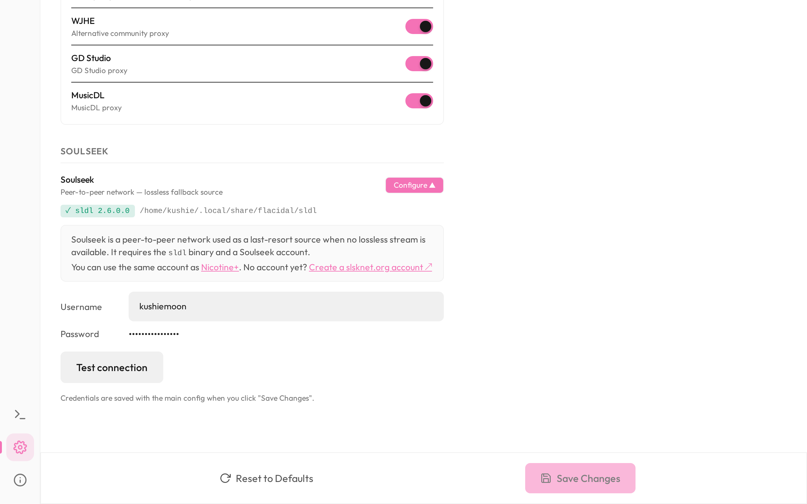
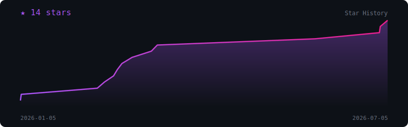

<div align="center">



### YouTube Video + Lossless FLAC = Perfect MKV

[](https://github.com/kushiemoon-dev/YouFLAC/releases/latest)
[](https://github.com/kushiemoon-dev/YouFLAC/stargazers)
[](LICENSE)
[](https://go.dev)


</div>

---

## Overview

**YouFLAC** (**You**Tube + **FLAC**) is a self-hosted web app that combines YouTube video downloads with lossless audio. Paste a YouTube (or Spotify / Tidal) URL, and YouFLAC:

1. Downloads the video via **yt-dlp**
2. Fetches the best available **lossless FLAC** from **Soulseek** first, with automatic fallback to Tidal, Qobuz, Amazon Music, or Bandcamp
3. Muxes video + FLAC into a single **MKV** file via FFmpeg

Every FLAC is verified for integrity and quality (sample rate, bit depth, true-lossless flag) before muxing. Bad files are discarded and the next source is tried automatically.

---

## Screenshots

<div align="center">

| Home — paste any YouTube URL | Download Queue |
|------------------------------|----------------|
|  |  |

| Source Priority (drag-and-drop) | Soulseek Setup |
|--------------------------------|----------------|
|  |  |

</div>

---

## Features

- **YouTube → MKV** — paste any YouTube, Spotify, or Tidal URL; yt-dlp downloads the video, Soulseek provides the FLAC, FFmpeg muxes both into a high-quality `.mkv`
- **Playlists & Channels** — batch-download full YouTube playlists or channels
- **Soulseek as primary FLAC source** — via [slsk-batchdl](https://github.com/fiso64/slsk-batchdl) (v2.6+); includes a real login connectivity test
- **Multi-Source Fallback** — Soulseek → Tidal → Qobuz → Amazon Music → Bandcamp, tried in your configured priority order
- **FLAC Verification** — integrity check + sample rate/bit depth/lossless validation before muxing; rejects fake-lossless files
- **Source Priority UI** — drag-and-drop reorder directly in the settings panel
- **Queue System** — concurrent downloads with live progress, retry, and WebSocket updates
- **Playlist** — auto-generates `.m3u8` after batch downloads
- **NFO + Lyrics** — metadata files for Jellyfin/Plex/Kodi, synced lyrics from LRCLIB

---

## Install

### Desktop App

**[⬇ Download Latest Release](https://github.com/kushiemoon-dev/YouFLAC/releases/latest)**

| Platform | File |
|----------|------|
| Windows x64 | `youflac.exe` |
| macOS Universal | `youflac.dmg` |
| Linux x64 | `youflac.AppImage` |

### Headless / Self-hosted (advanced)

For running YouFLAC on a home server, NAS, or headless box without a desktop environment.

**[⬇ Download Latest Release](https://github.com/kushiemoon-dev/YouFLAC/releases/latest)**

| Platform | File |
|----------|------|
| Linux x86_64 | `youflac-server-linux-amd64.tar.gz` |
| Linux ARM64 | `youflac-server-linux-arm64.tar.gz` |
| macOS Apple Silicon | `youflac-server-darwin-arm64.tar.gz` |
| Windows x86_64 | `youflac-server-windows-amd64.zip` |

```bash
tar -xzf youflac-server-linux-amd64.tar.gz
cd youflac-server-linux-amd64
./youflac-server
```

> **Note:** Native binaries require **FFmpeg**, **ffprobe**, and **yt-dlp** in PATH.  
> Soulseek requires [slsk-batchdl](https://github.com/fiso64/slsk-batchdl) v2.6+ (`sldl` binary).

### API

| Method | Endpoint | Description |
|--------|----------|-------------|
| `GET` | `/api/health` | Health check |
| `GET` | `/api/version` | Current version |
| `GET` | `/api/queue` | List queue items |
| `POST` | `/api/queue` | Add item (URL or metadata) |
| `POST` | `/api/queue/:id/pause` | Pause an item |
| `POST` | `/api/queue/:id/resume` | Resume an item |
| `POST` | `/api/queue/retry-failed` | Retry all failed items |
| `GET` | `/api/sources` | List registered sources and status |
| `POST` | `/api/soulseek/login-test` | Test Soulseek credentials |
| `GET` | `/api/services/status` | Source service health |

---

## Configuration

All options can be set via environment variables or through the web UI.

### Core

| Variable | Default | Description |
|----------|---------|-------------|
| `PORT` | `8080` | HTTP server port |
| `OUTPUT_DIR` | `/downloads` | Download output directory |
| `CONFIG_DIR` | `/config` | Config and database directory |
| `CONCURRENT_DOWNLOADS` | `2` | Parallel downloads (1–5) |
| `NAMING_TEMPLATE` | `jellyfin` | `jellyfin`, `plex`, `flat`, `album`, `year` |
| `LOG_LEVEL` | `info` | `debug`, `info`, `warn`, `error` |

### Sources

| Variable | Default | Description |
|----------|---------|-------------|
| `SOURCE_ORDER` | `soulseek,tidal,qobuz,amazon,bandcamp` | Fallback order for FLAC source selection |
| `SOULSEEK_USERNAME` | _(none)_ | Soulseek account username |
| `SOULSEEK_PASSWORD` | _(none)_ | Soulseek account password |
| `SOULSEEK_BINARY_PATH` | _(auto)_ | Path to `sldl` binary (auto-detected if in PATH) |

### Video

| Variable | Default | Description |
|----------|---------|-------------|
| `VIDEO_QUALITY` | `best` | yt-dlp video quality: `best`, `1080p`, `720p`, `480p` |
| `COOKIES_BROWSER` | _(none)_ | Browser to extract cookies from for age-restricted videos: `firefox`, `chrome`, `chromium`, `brave`, `opera`, `edge` |

### Verification

| Variable | Default | Description |
|----------|---------|-------------|
| `VERIFY_DOWNLOADS` | `true` | Verify every FLAC before accepting it |
| `VERIFY_MIN_SAMPLE_RATE` | `44100` | Reject files below this sample rate (Hz) |
| `VERIFY_MIN_BIT_DEPTH` | `16` | Reject files below this bit depth |

### Output

| Variable | Default | Description |
|----------|---------|-------------|
| `OUTPUT_DIR` | `~/MusicVideos` | Download output directory |
| `GENERATE_NFO` | `true` | Generate NFO metadata files |
| `EMBED_COVER_ART` | `true` | Embed cover art in output files |
| `LYRICS_ENABLED` | `false` | Fetch synced lyrics automatically |
| `LYRICS_EMBED_MODE` | `lrc` | `lrc`, `embed`, `both` |

---

## How It Works

```
YouTube / Spotify / Tidal URL
        │
   ┌────┴──────────────────────────┐
   ▼                               ▼
yt-dlp (video)         Source Orchestrator (FLAC)
   │                   (SOURCE_ORDER: soulseek first)
   │                        │
   │              ┌─────────┼──────────┬───────────┐
   │              ▼         ▼          ▼           ▼
   │           Soulseek   Tidal     Qobuz    Amazon/Bandcamp
   │            (sldl)    FLAC      FLAC         FLAC
   │              └─────────┼──────────┴───────────┘
   │                        │ first success
   │                        ▼
   │                 FLAC Verification
   │                 (integrity + sample rate / bit depth)
   │                        │
   │                   pass ▼     fail ──► try next source
   └──────────────► FFmpeg mux (-f matroska)
                            │
                            ▼
                      Output .mkv
                   + NFO + Lyrics

  Note: if video download fails (geo-block, age-restrict),
  YouFLAC falls back to audio-only and outputs .flac instead.
```

---

## Soulseek Setup

1. Install [slsk-batchdl](https://github.com/fiso64/slsk-batchdl) (v2.6+) and place `sldl` somewhere in PATH or set `SOULSEEK_BINARY_PATH`
2. Set `SOULSEEK_USERNAME` and `SOULSEEK_PASSWORD` (env vars or Settings UI)
3. Use the **Test Login** button in Settings → Sources to verify connectivity before downloading

---

## Build from Source

```bash
git clone https://github.com/kushiemoon-dev/YouFLAC.git
cd YouFLAC
```

### Desktop app (Wails)

```bash
wails build
```

Output: `build/bin/youflac`. Requires the [Wails CLI](https://wails.io) (`go install github.com/wailsapp/wails/v2/cmd/wails@latest`), Go 1.25+, Node.js 22+, pnpm 11+.

### Headless server

```bash
# Build frontend
cd frontend && pnpm install --frozen-lockfile && pnpm build && cd ..

# Build server
go build -o youflac-server ./cmd/server

# Run
./youflac-server
```

Requires Go 1.25+, Node.js 22+, pnpm 11+.

---

## Credits

- [yt-dlp](https://github.com/yt-dlp/yt-dlp) — YouTube video downloading
- [slsk-batchdl](https://github.com/fiso64/slsk-batchdl) — Soulseek batch downloader
- [FFmpeg](https://ffmpeg.org) — Video/audio muxing and verification
- [Fiber](https://gofiber.io) — HTTP framework
- [Deezer API](https://developers.deezer.com) — ISRC enrichment during downloads
- [LRCLIB](https://lrclib.net) — Synced lyrics

---

## Star History

<div align="center">

[](https://github.com/kushiemoon-dev/YouFLAC/stargazers)

</div>

---

## Disclaimer

YouFLAC is intended for **personal and educational use only**. It is not affiliated with Soulseek, Tidal, Qobuz, Amazon Music, Bandcamp, or Deezer. By using this tool you agree to comply with all applicable laws and the terms of service of the platforms involved. The developers assume no liability for any misuse.

---

<div align="center">

**MIT License** · [Releases](https://github.com/kushiemoon-dev/YouFLAC/releases) · [Issues](https://github.com/kushiemoon-dev/YouFLAC/issues)

</div>
