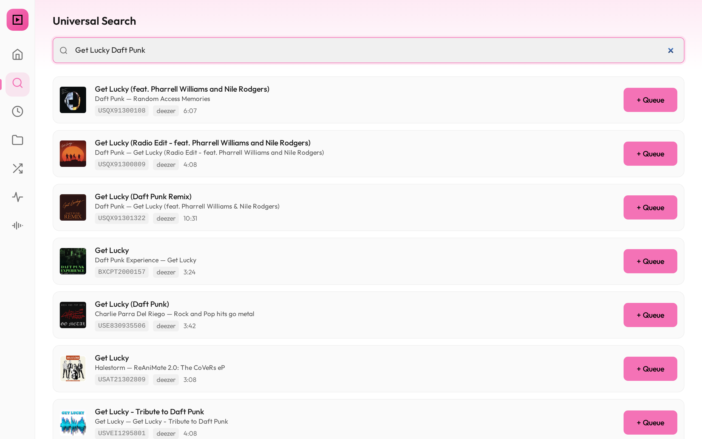
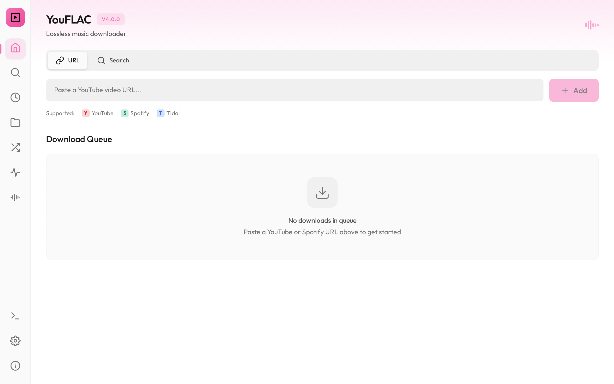
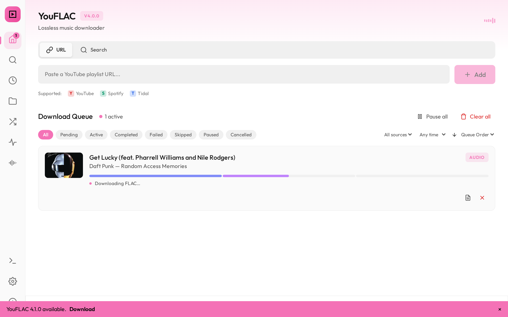
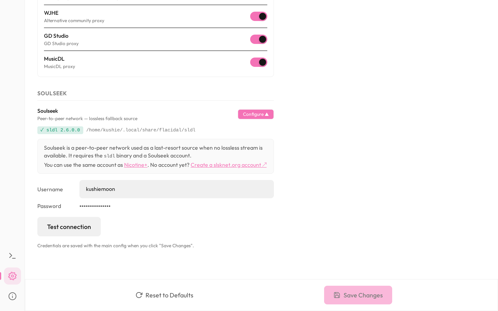

<div align="center">


### Lossless music downloader — Soulseek · Tidal · Qobuz · Amazon · Bandcamp

[](https://github.com/kushiemoon-dev/YouFLAC/releases/latest)
[](https://github.com/kushiemoon-dev/YouFLAC/pkgs/container/youflac)
[](LICENSE)
[](https://go.dev)


</div>

---

## Overview

**YouFLAC** is a self-hosted lossless music downloader with a clean web UI. Search for any track, add it to a queue, and YouFLAC fetches the best available FLAC from Soulseek, Tidal, Qobuz, Amazon Music, or Bandcamp — automatically falling back through sources in your configured priority order.

Every downloaded file is verified for integrity and quality (sample rate, bit depth, true-lossless flag) before it lands in your library. Bad files are silently discarded and the next source is tried.

---

## Screenshots

<div align="center">

**Universal Search — search any track, add to queue in one click**



| Home & Download Queue | Queue — FLAC downloading |
|----------------------|--------------------------|
|  |  |

| Source Priority (drag-and-drop) | Soulseek Setup |
|--------------------------------|----------------|
|  |  |

</div>

---

## Features

- **Universal Search** — search across Deezer's catalog; click to add any track to the queue
- **Multi-Source Fallback** — Soulseek · Tidal · Qobuz · Amazon Music · Bandcamp, tried in your priority order
- **FLAC Verification** — integrity check + sample rate/bit depth/lossless validation; rejects fake-lossless files
- **Soulseek via sldl** — shells out to [slsk-batchdl](https://github.com/fiso64/slsk-batchdl) (v2.6+); includes a real login connectivity test
- **Source Priority UI** — drag-and-drop reorder directly in the settings panel
- **Queue System** — concurrent downloads with live progress, retry, and WebSocket updates
- **Playlist** — auto-generates `.m3u8` after batch downloads
- **NFO + Lyrics** — metadata files for Jellyfin/Plex/Kodi, synced lyrics from LRCLIB
- **Docker + Native** — ships as a single binary or Docker image (amd64 / arm64)

---

## Install

### Docker Compose (recommended)

```bash
git clone https://github.com/kushiemoon-dev/YouFLAC.git
cd YouFLAC
cp .env.example .env   # fill in your credentials
docker compose up -d
```

Access the UI at **http://localhost:8080**

### Docker Run

```bash
docker run -d \
  --name youflac \
  -p 8080:8080 \
  -v ./config:/config \
  -v ./downloads:/downloads \
  -e SOULSEEK_USERNAME=you \
  -e SOULSEEK_PASSWORD=secret \
  ghcr.io/kushiemoon-dev/youflac:latest
```

### Native Binary

**[⬇ Download Latest Release](https://github.com/kushiemoon-dev/YouFLAC/releases/latest)**

| Platform | File |
|----------|------|
| Linux x86_64 | `youflac-server-linux-amd64.tar.gz` |
| Linux ARM64 | `youflac-server-linux-arm64.tar.gz` |
| macOS Apple Silicon | `youflac-server-darwin-arm64.tar.gz` |
| Windows x86_64 | `youflac-server-windows-amd64.zip` |

```bash
tar -xzf youflac-server-linux-amd64.tar.gz
cd youflac-server-linux-amd64
./youflac-server
```

> **Note:** Native binaries require **FFmpeg** and **ffprobe** in PATH.  
> Soulseek requires [slsk-batchdl](https://github.com/fiso64/slsk-batchdl) v2.6+ (`sldl` binary).

---

## Configuration

All options can be set via environment variables or through the web UI.

### Core

| Variable | Default | Description |
|----------|---------|-------------|
| `PORT` | `8080` | HTTP server port |
| `OUTPUT_DIR` | `/downloads` | Download output directory |
| `CONFIG_DIR` | `/config` | Config and database directory |
| `CONCURRENT_DOWNLOADS` | `2` | Parallel downloads (1–5) |
| `NAMING_TEMPLATE` | `jellyfin` | `jellyfin`, `plex`, `flat`, `album`, `year` |
| `LOG_LEVEL` | `info` | `debug`, `info`, `warn`, `error` |

### Sources

| Variable | Default | Description |
|----------|---------|-------------|
| `SOURCE_ORDER` | `tidal,qobuz,amazon,bandcamp,soulseek` | Fallback order for source selection |
| `SOULSEEK_USERNAME` | _(none)_ | Soulseek account username |
| `SOULSEEK_PASSWORD` | _(none)_ | Soulseek account password |
| `SOULSEEK_BINARY_PATH` | _(auto)_ | Path to `sldl` binary (auto-detected if in PATH) |

### Verification

| Variable | Default | Description |
|----------|---------|-------------|
| `VERIFY_DOWNLOADS` | `true` | Verify every FLAC before accepting it |
| `VERIFY_MIN_SAMPLE_RATE` | `44100` | Reject files below this sample rate (Hz) |
| `VERIFY_MIN_BIT_DEPTH` | `16` | Reject files below this bit depth |

### Output

| Variable | Default | Description |
|----------|---------|-------------|
| `GENERATE_NFO` | `true` | Generate NFO metadata files |
| `EMBED_COVER_ART` | `true` | Embed cover art in output files |
| `LYRICS_ENABLED` | `false` | Fetch synced lyrics automatically |
| `LYRICS_EMBED_MODE` | `lrc` | `lrc`, `embed`, `both` |

---

## How It Works

```
Search query (title + artist)
        │
        ▼
   Deezer API ──► ISRC + normalized metadata
        │
        ▼
    Queue entry (metadata-first, no URL required)
        │
        ▼
  Source Orchestrator
  (tries sources in SOURCE_ORDER)
        │
   ┌────┴────┬────────┬──────────┬───────────┐
   ▼         ▼        ▼          ▼           ▼
Soulseek   Tidal   Qobuz    Amazon Music  Bandcamp
 (sldl)    FLAC    FLAC        FLAC         FLAC
   └────┬────┴────────┴──────────┴───────────┘
        │ first success
        ▼
  FLAC Verification
  (flac -t · ffprobe quality check)
        │
   pass ▼         fail ──► try next source
  Output file
  + NFO + Lyrics
```

---

## Soulseek Setup

1. Install [slsk-batchdl](https://github.com/fiso64/slsk-batchdl) (v2.6+) and place `sldl` somewhere in PATH or set `SOULSEEK_BINARY_PATH`
2. Set `SOULSEEK_USERNAME` and `SOULSEEK_PASSWORD` (env vars or Settings UI)
3. Use the **Test Login** button in Settings → Sources to verify connectivity before downloading

The Docker image bundles a pre-compiled `sldl` for linux/amd64 and linux/arm64.

---

## API

| Method | Endpoint | Description |
|--------|----------|-------------|
| `GET` | `/api/health` | Health check |
| `GET` | `/api/version` | Current version |
| `GET` | `/api/queue` | List queue items |
| `POST` | `/api/queue` | Add item (URL or metadata) |
| `POST` | `/api/queue/:id/pause` | Pause an item |
| `POST` | `/api/queue/:id/resume` | Resume an item |
| `POST` | `/api/queue/retry-failed` | Retry all failed items |
| `GET` | `/api/search/universal?q=` | Search via Deezer |
| `GET` | `/api/sources` | List registered sources and status |
| `POST` | `/api/soulseek/login-test` | Test Soulseek credentials |
| `GET` | `/api/services/status` | Source service health |

---

## Build from Source

```bash
git clone https://github.com/kushiemoon-dev/YouFLAC.git
cd YouFLAC

# Build frontend
cd frontend && pnpm install --frozen-lockfile && pnpm build && cd ..

# Build server
go build -o youflac-server ./cmd/server

# Run
./youflac-server
```

Requires Go 1.25+, Node.js 22+, pnpm 11+.

---

## Credits

- [slsk-batchdl](https://github.com/fiso64/slsk-batchdl) — Soulseek batch downloader
- [FFmpeg](https://ffmpeg.org) — Media processing and verification
- [Fiber](https://gofiber.io) — HTTP framework
- [Deezer API](https://developers.deezer.com) — Track search and ISRC enrichment
- [LRCLIB](https://lrclib.net) — Synced lyrics

---

## Disclaimer

YouFLAC is intended for **personal and educational use only**. It is not affiliated with Soulseek, Tidal, Qobuz, Amazon Music, Bandcamp, or Deezer. By using this tool you agree to comply with all applicable laws and the terms of service of the platforms involved. The developers assume no liability for any misuse.

---

<div align="center">

**MIT License** · [Releases](https://github.com/kushiemoon-dev/YouFLAC/releases) · [Issues](https://github.com/kushiemoon-dev/YouFLAC/issues)

</div>
